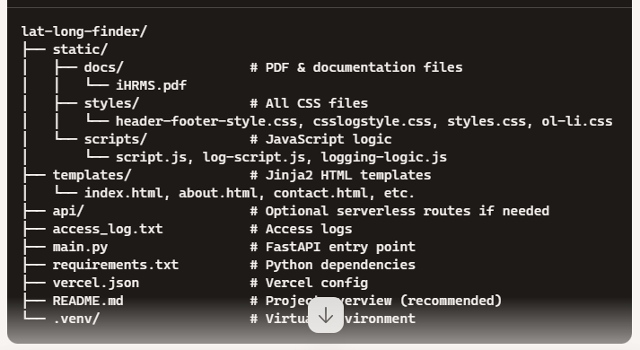

# Project Overview
# 🗺️ Lat-Long-Finder by SmartSchoolAI

An educational geolocation tool built with FastAPI and deployed on Vercel. This app captures user latitude, longitude, and browser details and logs them for interactive visualization and location tracking. Designed by **Jagdev Singh Dosanjh** to demonstrate real-time geospatial insights for schools and educators.

## 🚀 Features

- 📍 Live geolocation tracking using browser API
- 🧠 Intelligent access logging with timestamp, location & device info
- 🗂️ Modular VS Code project with HTML templates and embedded PDFs
- 🌐 Google Maps integration (via iframe & API)
- 📄 Serverless deployment using Vercel + FastAPI
- 📈 Analytics extension for platform and region tracking

## 🏗️ Project Structure


lat-long-finder/ ├── static/ │ ├── styles/ │ ├── scripts/ │ └── docs/ ├── templates/ ├── access_log.txt ├── main.py ├── requirements.txt ├── vercel.json └── README.md


## 🧪 Getting Started (Local)

```bash
python -m venv .venv
source .venv/Scripts/activate  # Windows
pip install -r requirements.txt
uvicorn main:app --reload

🌍 Deployment (Vercel)
vercel login
vercel deploy --prod

📊 Analytics Added
Collects geolocation (lat/lng)

Logs userAgent to identify platform/browser

Extendable to third-party dashboards or JSON exports

🔒 Privacy Considerations
This project captures anonymous geolocation and browser info for educational tracking. Use responsibly.

👨‍🏫 Author
Jagdev Singh Dosanjh Computer Science Faculty | Educational Innovator Email: jagdevsinghdosanjh@gmail.com

---

## 🔎 Analytics: Platform & Region Tracking Enhancement

In your existing `log-script.js`, enrich the data capture to include:

```js
window.addEventListener("load", () => {
  const userAgent = navigator.userAgent;
  const platform = navigator.platform || "Unknown";

  function sendLog(locationStr) {
    fetch("/log-access", {
      method: "POST",
      headers: { "Content-Type": "application/json" },
      body: JSON.stringify({
        agent: userAgent,
        location: locationStr,
        platform: platform
      })
    });
  }

  if ("geolocation" in navigator) {
    navigator.geolocation.getCurrentPosition(
      (pos) => {
        const lat = pos.coords.latitude.toFixed(5);
        const lng = pos.coords.longitude.toFixed(5);
        sendLog(`${lat},${lng}`);
      },
      () => sendLog("Permission denied")
    );
  } else {
    sendLog("Geolocation not supported");
  }
});

And update your FastAPI route in main.py to log this platform:
@app.post("/log-access")
async def log_access(request: Request):
    data = await request.json()
    timestamp = datetime.now().strftime("%Y-%m-%d %H:%M:%S")
    log_entry = (
        f"[{timestamp}] IP: {request.client.host}, "
        f"Agent: {data.get('agent')}, "
        f"Platform: {data.get('platform')}, "
        f"Location: {data.get('location')}\n"
    )
    with open("access_log.txt", "a") as f:
        f.write(log_entry)
    return {"status": "logged"}
